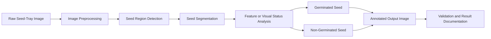
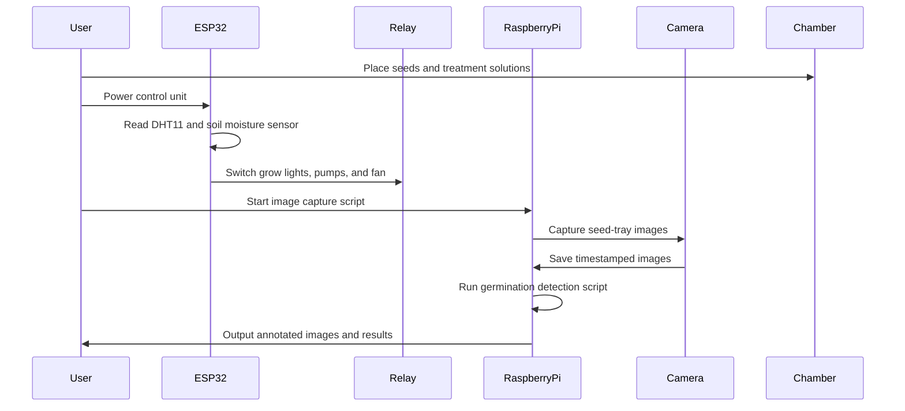

````markdown
# Open-Source Automated Grow Chamber for Controlled Seed Germination Monitoring Using IoT-Based Sensing and Computer Vision

<p align="center">
  
  
  
  
  
</p>

---

## Overview

This repository provides the complete open-source hardware, firmware, software, documentation, and validation files for an automated grow chamber developed for controlled seed germination monitoring.

The system integrates an ESP32-based sensing and control unit, DHT11 temperature-humidity sensing, soil moisture monitoring, relay-controlled grow lights, exhaust-fan-based air circulation, four peristaltic pumps for liquid delivery, liquid reservoirs, a Raspberry Pi camera module, and computer-vision-based germination detection.

The repository is intended to support reproducibility, modification, validation, and reuse by researchers, students, and laboratories working on seed germination studies, treatment-based germination experiments, early plant-growth monitoring, and controlled-environment agriculture.

---

## Index

- [Overview](#overview)
- [Key Features](#key-features)
- [System Architecture](#system-architecture)
- [Repository Structure](#repository-structure)
- [Hardware Components](#hardware-components)
- [Software and Firmware](#software-and-firmware)
- [Installation Requirements](#installation-requirements)
- [ESP32 Firmware Setup](#esp32-firmware-setup)
- [Raspberry Pi Camera Setup](#raspberry-pi-camera-setup)
- [Germination Detection Workflow](#germination-detection-workflow)
- [Operating Procedure](#operating-procedure)
- [Validation Protocol](#validation-protocol)
- [Bill of Materials](#bill-of-materials)
- [Data Organization](#data-organization)
- [Documentation](#documentation)
- [Reproducibility Notes](#reproducibility-notes)
- [Safety Notes](#safety-notes)
- [Known Limitations](#known-limitations)
- [Licensing](#licensing)
- [Citation](#citation)
- [Maintainer](#maintainer)
- [Repository Status](#repository-status)

---

## Key Features

| Category | Description |
|---|---|
| Open-source hardware | Reproducible chamber design, wiring files, assembly documentation, and validation protocol |
| Embedded control | ESP32-based sensor monitoring and relay-based actuator switching |
| Environmental monitoring | DHT11 temperature-humidity sensing and soil moisture monitoring |
| Actuation | Relay-controlled grow lights, four peristaltic pumps, and exhaust fan |
| Imaging | Raspberry Pi camera-based seed-tray image acquisition |
| Computer vision | Image-based classification of germinated and non-germinated seeds |
| Treatment support | Separate reservoirs and pump lines for water or treatment solutions |
| Validation-ready | Includes pump flow characterization, camera validation, sensor validation, and integrated system checks |

---

## System Architecture

```mermaid
flowchart TD
    A[Power Supply] --> B[ESP32 Control Unit]
    A --> C[Raspberry Pi]
    A --> D[Relay Module]

    B --> E[DHT11 Temperature-Humidity Sensor]
    B --> F[Soil Moisture Sensor]
    B --> D

    D --> G[Grow Light 1]
    D --> H[Grow Light 2]
    D --> I[Peristaltic Pump 1]
    D --> J[Peristaltic Pump 2]
    D --> K[Peristaltic Pump 3]
    D --> L[Peristaltic Pump 4]
    D --> M[Exhaust Fan]

    C --> N[Raspberry Pi Camera]
    N --> O[Seed-Tray Image Capture]
    O --> P[Computer-Vision Processing]
    P --> Q[Germinated / Non-Germinated Classification]

    I --> R[Liquid Reservoir 1]
    J --> S[Liquid Reservoir 2]
    K --> T[Liquid Reservoir 3]
    L --> U[Liquid Reservoir 4]

    R --> V[Germination Tray]
    S --> V
    T --> V
    U --> V
````

---

## Repository Structure

```text
smart-grow-chamber/
│
├── README.md
├── LICENSE
├── CITATION.cff
│
├── hardware/
│   ├── wiring/
│   │   ├── wiring_diagram.drawio
│   │   ├── wiring_diagram.png
│   │   └── wiring_diagram.pdf
│   │
│   ├── mechanical/
│   │   ├── chamber_layout.png
│   │   ├── chamber_layout.pdf
│   │   └── dimensions.md
│   │
│   └── bom/
│       ├── bill_of_materials.xlsx
│       └── bill_of_materials.csv
│
├── firmware/
│   └── esp32_control/
│       ├── esp32_control.ino
│       └── pin_mapping.md
│
├── software/
│   ├── pi_camera/
│   │   └── image_capture.py
│   │
│   ├── computer_vision/
│   │   └── germination_detection.py
│   │
│   └── config/
│       └── config.yaml
│
├── docs/
│   ├── assembly/
│   │   └── assembly_guide.md
│   │
│   ├── operation/
│   │   └── operation_manual.md
│   │
│   ├── validation/
│   │   └── validation_protocol.md
│   │
│   └── figures/
│       ├── system_architecture.png
│       ├── control_flow.png
│       ├── prototype_layout.png
│       └── germination_workflow.png
│
├── data/
│   ├── sample_images/
│   ├── processed_outputs/
│   └── validation_results/
│
└── licenses/
    ├── CERN-OHL-W-2.0.txt
    ├── MIT.txt
    └── CC-BY-4.0.txt
```

---

## Hardware Components

| Component                         | Quantity | Function                                             |
| --------------------------------- | -------: | ---------------------------------------------------- |
| ESP32 development board           |        1 | Sensor reading and actuator control                  |
| Raspberry Pi board                |        1 | Image acquisition and image-processing support       |
| Raspberry Pi camera module        |        1 | Seed-tray image capture                              |
| DHT11 temperature-humidity sensor |        1 | Chamber temperature and relative humidity monitoring |
| Soil moisture sensor              |        1 | Moisture monitoring near the germination medium      |
| Relay module                      |    1 set | Switching grow lights, pumps, and exhaust fan        |
| LED grow lights                   |        2 | Artificial illumination                              |
| Peristaltic pumps                 |        4 | Liquid or treatment-solution delivery                |
| Exhaust fan                       |        1 | Air circulation                                      |
| Liquid reservoirs                 |        4 | Water or treatment solutions                         |
| Flexible tubing                   |    1 set | Fluid delivery                                       |
| Germination tray                  |        1 | Seed placement                                       |
| Transparent chamber enclosure     |        1 | Chamber structure                                    |

---

## Software and Firmware

| File                                                | Description                                              |
| --------------------------------------------------- | -------------------------------------------------------- |
| `firmware/esp32_control/esp32_control.ino`          | ESP32 firmware for sensor reading and relay switching    |
| `firmware/esp32_control/pin_mapping.md`             | GPIO pin mapping for sensors and relay channels          |
| `software/pi_camera/image_capture.py`               | Raspberry Pi camera script for timestamped image capture |
| `software/computer_vision/germination_detection.py` | Computer-vision script for germination detection         |
| `software/config/config.yaml`                       | User-editable experiment configuration file              |

---

## Installation Requirements

### ESP32 Firmware Environment

Recommended tools:

```text
Arduino IDE or PlatformIO
ESP32 board package
DHT sensor library
Adafruit Unified Sensor library
```

### Raspberry Pi Environment

Recommended operating system:

```text
Raspberry Pi OS
```

Recommended Python packages:

```text
opencv-python
numpy
pandas
matplotlib
picamera2
```

Install core packages on Raspberry Pi:

```bash
sudo apt update
sudo apt install -y python3-picamera2 python3-opencv python3-numpy python3-pandas
```

For non-camera processing in a Python environment:

```bash
pip install opencv-python numpy pandas matplotlib
```

---

## ESP32 Firmware Setup

1. Open the firmware file:

```text
firmware/esp32_control/esp32_control.ino
```

2. Install the required Arduino libraries:

```text
DHT sensor library
Adafruit Unified Sensor
```

3. Select the correct ESP32 board and serial port.

4. Verify the GPIO pin mapping in:

```text
firmware/esp32_control/pin_mapping.md
```

5. Upload the firmware to the ESP32.

6. Open Serial Monitor at:

```text
115200 baud
```

7. Confirm that the following readings are displayed:

```text
Temperature
Relative humidity
Soil moisture value
Relay switching status
```

---

## Raspberry Pi Camera Setup

1. Connect the Raspberry Pi camera module to the CSI camera port.

2. Enable camera support if required.

3. Navigate to the image capture folder:

```bash
cd software/pi_camera
```

4. Run the image capture script:

```bash
python3 image_capture.py
```

5. Confirm that timestamped images are saved in the output folder.

Example filename:

```text
germination_test_2026-05-26_10-30-00.jpg
```

---

## Germination Detection Workflow



The detection workflow processes captured images and generates annotated outputs that can be compared with manual observation.

---

## Operating Procedure



Basic operating steps:

1. Place the germination tray inside the chamber.
2. Fill and label liquid reservoirs.
3. Confirm tube routing to the correct tray regions.
4. Power the ESP32 and verify sensor readings.
5. Test each relay channel.
6. Power the Raspberry Pi and start image acquisition.
7. Run the experiment for the selected duration.
8. Process captured images using the germination detection script.
9. Record sensor readings, pump timing, image intervals, and detection results.
10. Clean the chamber and flush tubing after the experiment.

---

## Validation Protocol

The system should be validated before biological experiments.

| Validation Test                     | Purpose                                             |
| ----------------------------------- | --------------------------------------------------- |
| Environmental monitoring validation | Verify DHT11 temperature and humidity readings      |
| Moisture monitoring validation      | Verify soil moisture sensor response                |
| Relay switching validation          | Confirm correct switching of lights, pumps, and fan |
| Pump flow characterization          | Measure delivered volume and flow rate              |
| Camera validation                   | Confirm clear top-view seed-tray image acquisition  |
| Germination detection validation    | Compare automated detection with manual observation |
| Integrated system validation        | Confirm complete system operation                   |

### Pump Flow Formula

```text
Flow rate = Delivered volume / Pump activation time
```

### Detection Agreement Formula

```text
Detection agreement (%) = Correctly classified seeds / Total number of seeds × 100
```

---

## Bill of Materials

The complete bill of materials is available in:

```text
hardware/bom/bill_of_materials.xlsx
hardware/bom/bill_of_materials.csv
```

Summary:

| Category             | Examples                                                      |
| -------------------- | ------------------------------------------------------------- |
| Control electronics  | ESP32, relay modules, wiring                                  |
| Imaging              | Raspberry Pi board, Raspberry Pi camera                       |
| Sensors              | DHT11 sensor, soil moisture sensor                            |
| Actuators            | Grow lights, peristaltic pumps, exhaust fan                   |
| Fluidics             | Reservoirs, tubing                                            |
| Mechanical structure | Transparent enclosure, germination tray, mounting accessories |

Approximate hardware cost:

```text
INR 11,247
```

The final cost may vary depending on local component availability, Raspberry Pi model, enclosure size, pump rating, and whether components are newly purchased or reused.

---

## Data Organization

Recommended data folder structure:

```text
data/
├── sample_images/
│   └── raw_images/
│
├── processed_outputs/
│   └── annotated_images/
│
└── validation_results/
    ├── environmental_readings.csv
    ├── pump_flow_test.csv
    ├── camera_validation.csv
    ├── germination_detection_results.csv
    └── integrated_validation_summary.csv
```

Raw images should be preserved and should not be overwritten. Processed outputs should be stored separately for validation and reproducibility.

---

## Documentation

| Document            | Path                                     |
| ------------------- | ---------------------------------------- |
| Assembly guide      | `docs/assembly/assembly_guide.md`        |
| Operation manual    | `docs/operation/operation_manual.md`     |
| Validation protocol | `docs/validation/validation_protocol.md` |
| Pin mapping         | `firmware/esp32_control/pin_mapping.md`  |
| Bill of materials   | `hardware/bom/bill_of_materials.xlsx`    |
| Wiring diagram      | `hardware/wiring/wiring_diagram.pdf`     |

---

## Reproducibility Notes

For each experiment, record:

```text
Seed type
Number of seeds
Treatment concentrations
Tray layout
Image capture interval
Experiment duration
Pump activation time
Grow-light schedule
Fan operation schedule
Temperature range
Relative humidity range
Soil moisture range
Firmware version
Software version
Camera position
Raw image folder
Processed output folder
```

---

## Safety Notes

* Keep ESP32, Raspberry Pi, relay modules, and power adapters away from liquid reservoirs and tube outlets.
* Confirm all voltage and current ratings before powering the system.
* Use relay modules with driver circuitry and flyback protection for pumps and fan.
* If bare relay circuits are used, add flyback diodes across motor terminals.
* Do not allow pumps to run dry for long periods.
* If AC-powered lighting is used, all AC wiring must be enclosed and insulated.
* Disconnect power before modifying wiring.
* Check for leakage before starting experiments.

---

## Known Limitations

| Limitation                 | Explanation                                                                                                                                        |
| -------------------------- | -------------------------------------------------------------------------------------------------------------------------------------------------- |
| No full climate regulation | The current system monitors temperature and humidity but does not actively regulate them using heater, cooler, humidifier, or dehumidifier modules |
| Basic sensor accuracy      | DHT11 and low-cost soil moisture sensors are suitable for monitoring but not high-precision environmental measurement                              |
| Image dependency           | Detection performance depends on lighting, focus, contrast, seed spacing, and root visibility                                                      |
| Small-scale design         | The current prototype is intended for small-scale germination studies                                                                              |
| Pump calibration required  | Peristaltic pumps require calibration for accurate liquid delivery                                                                                 |

---

## Licensing

This repository uses separate licenses for different file categories.

| Material                  | License        |
| ------------------------- | -------------- |
| Hardware design files     | CERN-OHL-W-2.0 |
| Firmware and software     | MIT License    |
| Documentation and figures | CC BY 4.0      |

License files are provided in:

```text
licenses/
```

---

## Citation

If you use this hardware design, firmware, software, or documentation, please cite the associated HardwareX article and repository archive.

```bibtex
@article{reddy_grow_chamber,
  title   = {An Open-Source Automated Grow Chamber for Controlled Seed Germination Monitoring Using IoT-Based Sensing and Computer Vision},
  author  = {Reddy, D. Ramesh},
  journal = {HardwareX},
  year    = {2026},
  note    = {Repository DOI to be added after Zenodo archival}
}
```

---

## Maintainer

| Field              | Information                                                                                                                                      |
| ------------------ | ------------------------------------------------------------------------------------------------------------------------------------------------ |
| Author             | D. Ramesh Reddy                                                                                                                                  |
| Affiliation        | Department of Electronics and Communication Engineering, VNR Vignana Jyothi Institute of Engineering and Technology, Hyderabad, Telangana, India |
| Repository purpose | HardwareX companion repository                                                                                                                   |
| Contact            | Add corresponding author email                                                                                                                   |

---

## Repository Status

| Item                              | Status                             |
| --------------------------------- | ---------------------------------- |
| Hardware design files             | Included                           |
| Firmware                          | Included                           |
| Raspberry Pi image capture script | Included                           |
| Germination detection script      | Included                           |
| Assembly guide                    | Included                           |
| Operation manual                  | Included                           |
| Validation protocol               | Included                           |
| Bill of materials                 | Included                           |
| Sample images                     | Included                           |
| Zenodo DOI                        | To be added after release archival |

```
